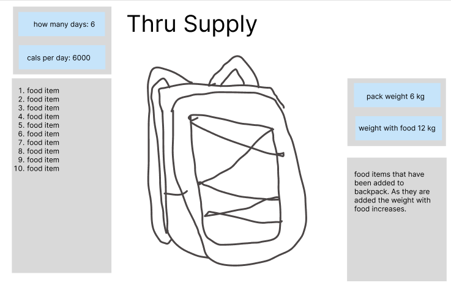

# Thru Supply

An app for hikers that allows you to enter your daily calorie goal, the number of days you’ll be hiking, and keeps track of your calories and the weight of your food as you plan your resupply.

 In 2022, every 4 - 8 days I would find myself in a grocery store in a small town somewhere along the American West Coast, stressing if I’d have enough calories to get me through the next stretch of trail as I made my way from Mexico to Canada along the Pacific Crest Trail.

I’d scan the nutritional information on the highly processed shelf-stable foods to find how many calories they had, then to ensure I was choosing the most calorie-dense options, I’d check to make sure there were at least 100 calories per 100 grams. Of course, this was harder in a country where everything is in ounces, so I’d have Google convert everything into grams for me, and then try to keep track of everything in my head. 

It made re-supply a stressful chore I hated doing, and having this app available would have made it a lot easier.

### how to use

Use the input fields to say how many days you’ll be in the backcountry and your daily calorie target. 
You’ll see the total amount of calories you’ll need based on these inputs.

As you add items to your food bag and increase thor quantity, you will see your total calories increase and will be told how many more you need.

If you like to count grams, you can keep track of the weight of your food, enter your base weight, and get an idea of how much your pack will weigh with your full resupply.

[A link to the Trello](https://trello.com/invite/b/5PNOsm6b/ATTI217b6bc1d93e4b06afa86d0e26f0da4f3651D992/thru-supply) board used for planning and project management

Very rought idea of how I wanted my project to look

##Technologies used
React, JavaScript, CSS.

### Next steps

Planned enhancements are to incorporate an API to search for more grocery items, incorporate a database to users can save their favourite items, and include a calorie calculator where users can input certain details including pack weight, hiking speed, distance, and incline to get a rough estimate of the number of calories required for them.

&copy; mimternet 2023
